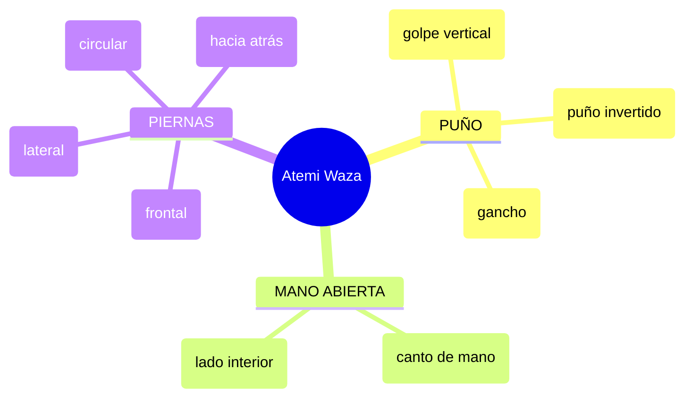

# 🥋 当て身技 (_Atemi Waza_) – Técnicas de Golpeo

![[Pasted image 20251003231052.png]]

## 🧾 Nombre en japonés

- **Kanji:** 当て身技

- **Romaji:** Atemi Waza

- **Traducción literal:** “Técnicas de golpeo al cuerpo”

---

## 📖 Descripción general

**Atemi Waza** son las técnicas de golpeo utilizadas en el **Jiu-Jitsu tradicional** para atacar puntos vitales (_kyūsho_) del cuerpo.

Se aplican como:

- **Ataques principales.**

- **Ruptura de guardia.**

- **Preparación previa** a una proyección (_[[Nage Waza]]_) o inmovilización (_[[Katame Waza]]_).

> [!info] Nota  
> En el contexto **deportivo** suelen enseñarse de forma **controlada o simbólica**;  
> en el **arte tradicional** son fundamentales en el _Goshin Jutsu_ (defensa personal real).

---

## 💥 Tipos de golpes

---

## 🧠 Principios técnicos

- **Velocidad y precisión** > fuerza bruta.

- **Focalizar en vulnerabilidades**: cuello, plexo, mentón, ingle, rodillas.

- **Uso táctico**: abrir espacio, desorientar o preparar una luxación.

> [!tip] Clave técnica  
> Un **atemi bien colocado** puede definir el combate en un instante, incluso sin potencia excesiva.

---

## 🧘 Dimensión espiritual

El _Budō_ enseña que los golpes deben usarse con:

- **Disciplina**

- **Autocontrol**

- **Respeto por la vida**

> [!quote] Filosofía  
> “Golpear sin odio, defender sin violencia: ese es el verdadero espíritu del guerrero.”

---

## 📚 Uso en el entrenamiento

- Práctica con **control y kata**.

- En grados avanzados → integración en secuencias de defensa real.

- En algunas _koryū_ (escuelas antiguas), los **atemi marcan el inicio del combate**.

---

## 🗂 Clasificación

|Categoría|Valor|
|---|---|
|**Tipo**|Waza (técnica)|
|**Familia**|Atemi Waza|
|**Aplicación**|Ataque directo, distracción, preparación para [[Nage Waza]] o [[Katame Waza]]|

---

## 📌 Notas adicionales

- Atemi Waza no son “golpes simples”: requieren **timing, sensibilidad y exactitud**.

- En estilos tradicionales, un **atemi preciso** suele preceder la técnica definitiva.

