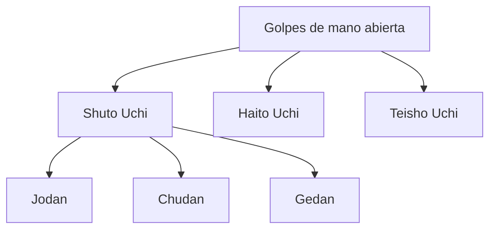

# Shuto Uchi (手刀打ち)

![[Pasted image 20251003233851.png]]![[Pasted image 20251003233811.png]]

## 1. **Nombre en japonés**

- **Kanji:** 手刀打ち
    
- **Romaji:** Shuto Uchi
    
- **Traducción literal:** “Golpe con el filo de la mano”
    

## 2. **Descripción general**

El **Shuto Uchi** es una técnica de **atemi waza** (golpeo) que utiliza el **filo externo de la mano** (lado del meñique) como superficie de impacto.

- Se aplica con la mano abierta y extendida, manteniendo los dedos juntos y rígidos.
    
- Es un golpe **rápido, preciso y cortante**, que busca zonas vulnerables del cuerpo como el cuello, la sien, la clavícula o los tendones.
    
- Es relevante porque combina **precisión y control**, evitando la necesidad de fuerza bruta y permitiendo neutralizar al oponente de forma eficaz.
    
---

## 3. **Principio técnico**

- **Arma natural:** el canto externo de la mano.
    
- **Dirección del golpe:** puede ejecutarse de arriba hacia abajo, lateral o diagonal.
    
- **Rotación corporal:** el poder surge de la **cadera y hombro**, no solo del brazo.
    
- **Kime (decisión):** el golpe termina con energía concentrada y controlada en el punto de impacto.
    
- **Respiración:** exhalación fuerte en el momento del contacto.
    

> [!tip]  
> La fuerza no proviene de la mano, sino de la **alineación corporal** y la transferencia del peso desde el suelo hasta el objetivo.

---

## 4. **Tipos de técnicas relacionadas**

- **Variantes de Shuto Uchi:**
    
    - Shuto Uchi Jodan (alto → cuello, sien).
    
    - Shuto Uchi Chudan (medio → clavícula, costillas).
    
    - Shuto Uchi Gedan (bajo → muslo, rodilla).
    
- **Técnicas asociadas:**
    
    - Shuto Uke (defensa con el filo de la mano).
    
    - Haito Uchi (golpe con el filo interno de la mano).
    
    - Uraken Uchi (golpe con el dorso del puño).
    

---

## 5. **Objetivos principales**

- Interrumpir o debilitar el ataque del oponente.

- Generar un impacto localizado en **zonas vitales o sensibles**.

- Controlar la distancia y mantener una **defensa activa**.

- Integrar la fluidez entre **defensa y contraataque**.

---

## 6. **Dimensión espiritual**

El **Shuto Uchi** enseña:

- **Precisión antes que fuerza.**

- **Control y responsabilidad** en el uso de técnicas potencialmente dañinas.

- La importancia de la **intención clara (kime)** en cada acción.

> [!info] Filosóficamente, representa el **“corte limpio”**, no solo en el cuerpo, sino también en la mente: decidir con firmeza y claridad.

---

## 7. **Disciplinas donde se practica**

- **Jiu-Jitsu tradicional**

- **Karate-do**

- **Aikido** (como variante en desvíos y controles)

- **Kobudo** (aplicaciones con armas cortas)

---

## 8. **Técnicas relacionadas**

|Técnica|Traducción literal|Relación con Shuto Uchi|
|---|---|---|
|**Shuto Uke**|Bloqueo con el filo de la mano|Defensa complementaria|
|**Haito Uchi**|Golpe con el filo interno|Variante de golpeo|
|**Uraken Uchi**|Golpe con dorso del puño|Alternativa de atemi|
|**Tetsui Uchi**|Golpe con martillo del puño|Misma lógica de impacto|

---

## 9. **Diagrama de clasificación**

