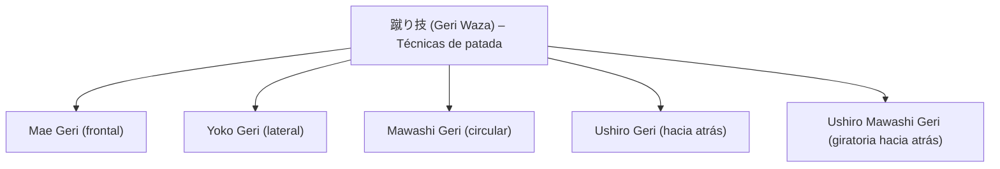

# 後ろ蹴り (_Ushiro Geri_) – Patada hacia atrás

![[Pasted image 20251003234312.png]]

##  1. Nombre en japonés

- **Kanji:** 後ろ蹴り
    
- **Romaji:** Ushiro Geri
    
- **Traducción literal:** _Patada hacia atrás_
    

---

##  2. Descripción general

El **Ushiro Geri** es una técnica de **patada hacia atrás** utilizada en el Jiu-Jitsu tradicional y otras artes marciales japonesas.

- Consiste en **girar ligeramente el cuerpo** y lanzar el talón o la planta del pie hacia atrás.
    
- Se emplea tanto como **ataque ofensivo** (contra un oponente que se aproxima por detrás) como **defensivo** (para mantener la distancia o frenar un ataque).
    
- Es particularmente útil para **romper la línea de avance** del adversario y generar espacio.
    

> [!info] Importancia  
> Ushiro Geri es considerado uno de los **golpes más potentes** del arsenal de patadas, gracias a la fuerza de la cadera y el talón como superficie de impacto.

---

## 3. Principio técnico

- **Rotación de la cadera**: la potencia nace de la cadera, no solo de la pierna.
    
- **Uso del talón como superficie de impacto**: concentra la energía en un punto pequeño.
    
- **Equilibrio y control**: el pie de apoyo debe estar firme y la guardia activa.
    
- **Velocidad y precisión**: no es un movimiento “ciego”; requiere conciencia espacial y dirección.
    

> [!tip] Clave técnica  
> Siempre **mirar por encima del hombro** antes de ejecutar el Ushiro Geri, asegurando la correcta dirección del golpe.

---

## 4. Tipos de técnicas relacionadas

El Ushiro Geri se relaciona con otras **geri waza (técnicas de patada)**:

- **Mae Geri (前蹴り)** – Patada frontal.
    
- **Yoko Geri (横蹴り)** – Patada lateral.
    
- **Mawashi Geri (回し蹴り)** – Patada circular.
    
- **Ushiro Mawashi Geri (後ろ回し蹴り)** – Patada giratoria hacia atrás.
    

---

## 🎯 5. Objetivos principales

- **Neutralizar ataques por la espalda.**
    
- **Crear distancia de seguridad.**
    
- **Desestabilizar o frenar al oponente.**
    
- **Usar la potencia del cuerpo entero para un impacto contundente.**
    

---

## 🧘 6. Dimensión espiritual

El Ushiro Geri no solo es una patada, sino una enseñanza de:

- **Conciencia de 360°**: el practicante debe estar atento al entorno, incluso a lo que ocurre a sus espaldas.
    
- **Confianza y calma**: exige controlar la energía y la dirección sin dejarse llevar por la impulsividad.
    
- **Responsabilidad en el uso de la fuerza**: al ser un golpe devastador, debe usarse con moderación y autocontrol.
    

> [!quote] Filosofía  
> “El guerrero no solo ve lo que tiene delante, sino lo que ocurre a su alrededor.”

---

## 7. Disciplinas donde se practica

- **Jiu-Jitsu tradicional japonés**
    
- **Karate-dō** (Shotokan, Kyokushin, Goju-ryu, etc.)
    
- **Taekwondo**
    
- **Hapkido**
    
- **Artes marciales mixtas (MMA)** → como técnica de contraataque o de control de distancia
    

---

## 8. Técnicas relacionadas

|Técnica|Kanji|Traducción|Relación|
|---|---|---|---|
|[[mae geri]]|前蹴り|Patada frontal|Base de las patadas rectas|
|[[yoko geri]]|横蹴り|Patada lateral|Similar mecánica de cadera|
|[[mawashi geri]]|回し蹴り|Patada circular|Variante circular|
|[[ushiro mawashi geri]]|後ろ回し蹴り|Patada giratoria hacia atrás|Evolución del Ushiro Geri con giro completo|
