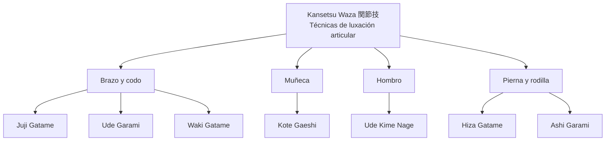

# Kansetsu Waza (関節技)

![[Pasted image 20251003232950.png]]

## 1. **Nombre en japonés**

- **Kanji:** 関節技

- **Romaji:** Kansetsu Waza

- **Traducción literal:** “Técnicas de articulación” o “Técnicas articulares”

---

## 2. **Descripción general**

El **Kansetsu Waza** agrupa todas las técnicas de **luxación, palanca y control articular**.

- Se aplican sobre las articulaciones principales: codo, hombro, muñeca, rodilla y tobillo.
    
- Su objetivo es generar **dolor, inmovilización o sometimiento** del adversario mediante palancas mecánicas.
    
- Relevancia: son técnicas fundamentales en el **Jiu-Jitsu tradicional**, la defensa personal y artes marciales modernas como el Judo y el BJJ, porque permiten controlar sin necesidad de golpes contundentes.
    

> [!warning]  
> Son técnicas que deben practicarse con sumo cuidado: una luxación aplicada con fuerza o sin control puede causar **lesiones permanentes**.

---

## 3. **Principio técnico**

Los fundamentos del Kansetsu Waza son:

1. **Palanca mecánica:** se utiliza un punto de apoyo (hueso, torso, suelo) para generar presión sobre la articulación.
    
2. **Dirección contraria al movimiento natural:** la articulación se fuerza en un ángulo antinatural.
    
3. **Control del cuerpo:** antes de aplicar, el oponente debe estar desequilibrado o inmovilizado.
    
4. **Progresividad:** aplicar presión de manera controlada, permitiendo al compañero rendirse (tap).
    
5. **Economía de fuerza:** la técnica se basa en **apalancamiento y biomecánica**, no en fuerza bruta.
    

---

## 4. **Tipos de técnicas relacionadas**

El Kansetsu Waza se clasifica en:

- **Luxaciones de brazo y codo (Ude Kansetsu):**
    
    - Ejemplo: Juji Gatame, Ude Garami.
        
- **Luxaciones de muñeca (Kote Kansetsu):**
    
    - Ejemplo: Kote Gaeshi.
        
- **Luxaciones de hombro:**
    
    - Ejemplo: Waki Gatame, Ude Kime Nage.
        
- **Luxaciones de pierna y rodilla (Ashi Kansetsu):**
    
    - Ejemplo: Hiza Gatame, Ashi Garami.
        

---

## 5. **Objetivos principales**

- Inmovilizar al oponente sin necesidad de golpear.
    
- Generar un **dolor controlado** para inducir la rendición.
    
- Enseñar precisión y control en la manipulación corporal.
    
- Desarrollar la conciencia de los puntos débiles del cuerpo humano.
    

---

## 6. **Dimensión espiritual**

- Representa la idea de **control a través de la mínima fuerza necesaria**.
    
- Enseña **compasión y autocontrol**: detenerse al límite de la lesión.
    
- Filosóficamente, simboliza la **armonía entre poder y responsabilidad**: el conocimiento de cómo romper implica el deber de proteger.
    

> [!info]  
> En la tradición marcial, el Kansetsu Waza enseña que el verdadero poder está en **dominar la técnica sin abusar de ella**.

---

## 7. **Disciplinas donde se practica**

- **Jiu-Jitsu tradicional**
    
- **Judo** (especialmente en ne-waza)
    
- **Brazilian Jiu-Jitsu (BJJ)**
    
- **Aikido** (luxaciones de control y proyección)
    
- **Sambo y artes marciales mixtas (MMA)**
    

---

## 8. **Técnicas relacionadas**

|Técnica|Traducción literal|Articulación|Relación con Kansetsu Waza|
|---|---|---|---|
|**Juji Gatame**|Control en cruz|Codo|Luxación clásica de brazo|
|**Ude Garami**|Enredo del brazo|Hombro/codo|Palanca y torsión combinada|
|**Waki Gatame**|Luxación de axila|Codo|Control con el sobaco|
|**Kote Gaeshi**|Proyección por torsión de muñeca|Muñeca|Común en Aikido y Jiu-Jitsu|
|**Ashi Garami**|Enredo de pierna|Rodilla|Control avanzado de pierna|

---

## 9. **Diagrama de clasificación**

