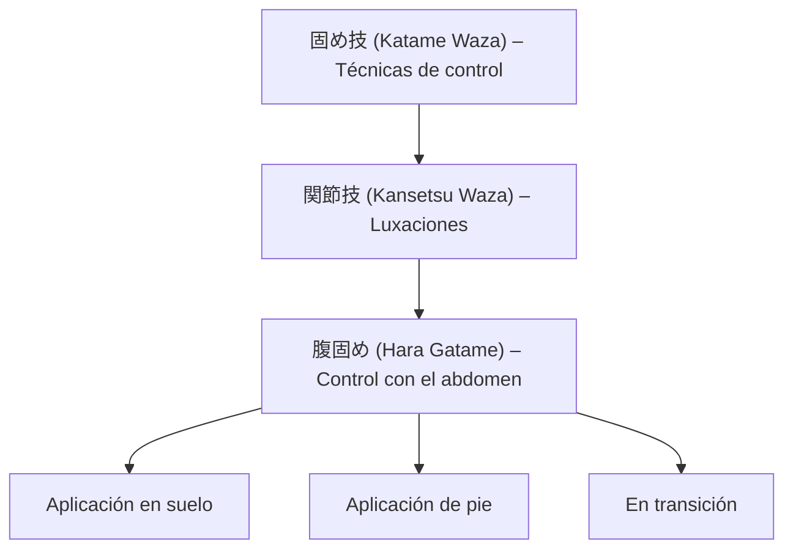

# 腹固め (_Hara Gatame_) – Control con el abdomen

![[Pasted image 20251004003211.png]]

## 🧾 1. Nombre en japonés

- **Kanji:** 腹固め
    
- **Romaji:** Hara Gatame
    
- **Traducción literal:** “Control con el abdomen”
    

---

## 📖 2. Descripción general

El **Hara Gatame** es una técnica de **luxación de brazo** dentro de la familia de [[katame waza]] (固め技 – técnicas de control).

- Se ejecuta atrapando el brazo del oponente contra el propio **abdomen/torso**, bloqueando el codo y generando presión hacia abajo.
    
- Es especialmente útil cuando el oponente se encuentra en el suelo o en transición desde una proyección.
    
- Su relevancia radica en que aprovecha el **centro del cuerpo (hara)** como punto de apoyo, lo que permite aplicar la técnica con gran estabilidad y eficacia.
    

> [!info] Nota  
> Aunque menos conocida que otras luxaciones como [[ude garami]] o [[juji gatame]], el Hara Gatame es altamente eficaz y sorprendente, al surgir muchas veces de **transiciones inesperadas**.

---

## ⚙️ 3. Principio técnico

- **Uso del hara (abdomen) como palanca:** el abdomen funciona como punto de presión para bloquear el codo.
    
- **Control del brazo extendido:** se inmoviliza el brazo del adversario contra el pecho y abdomen.
    
- **Aplicación del peso corporal:** no depende de la fuerza de brazos, sino del **peso del tronco**.
    
- **Alineación:** el codo del oponente debe estar extendido y bien controlado para generar dolor y sumisión.
    

> [!tip] Clave técnica  
> Mantener el tronco **pegado y compacto** al brazo del oponente evita escapes y aumenta la presión.

---

## 🗂️ 4. Tipos de técnicas relacionadas

El **Hara Gatame** pertenece a la subfamilia de [[kansetsu waza]] (関節技 – técnicas de luxación articular).

Variantes y situaciones:

- **Aplicación en suelo (ne waza):** tras inmovilizaciones.
    
- **Aplicación en transición:** luego de proyecciones o entradas fallidas.
    
- **Aplicación en control de pie:** usada para someter al adversario desde posición vertical.
    

---

## 🎯 5. Objetivos principales

- Forzar la sumisión mediante presión en el codo.
    
- Controlar al oponente con **mínima fuerza física**.
    
- Aprovechar el tronco como herramienta de luxación.
    
- Crear transición hacia otras técnicas de inmovilización o estrangulamiento.
    

---

## 🧘 6. Dimensión espiritual

El **Hara Gatame** enseña al practicante el valor del **centro (hara)** en la práctica marcial:

- Representa el **equilibrio interior** y la conexión del movimiento con el core.
    
- Transmite la idea de que la **fuerza verdadera surge del centro**, no de los miembros aislados.
    
- Refuerza la noción de **control sereno**: dominar sin brusquedad ni exceso de fuerza.
    

> [!quote] Filosofía  
> “Desde el centro nace la estabilidad; desde la estabilidad surge el control.”

---

## 🥋 7. Disciplinas donde se practica

- **Jiu-Jitsu tradicional japonés**
    
- **Judo** – dentro de las [[kansetsu waza]]
    
- **Brazilian Jiu-Jitsu (BJJ)** – aparece en variantes de sumisión menos comunes
    
- **Aikidō** – algunos controles articulares con el tronco tienen base similar
    

---

## 🔗 8. Técnicas relacionadas

|Técnica|Kanji|Traducción|Relación|
|---|---|---|---|
|[[katame waza]]|固め技|Técnicas de control|Familia principal|
|[[kansetsu waza]]|関節技|Luxaciones articulares|Subfamilia directa|
|[[ude garami]]|腕緘|Llave de brazo en figura 4|Luxación de codo/hombro|
|[[juji gatame]]|十字固め|Palanca de brazo en cruz|Luxación clásica en suelo|
|[[waki gatame]]|脇固め|Luxación con la axila|Variante con apoyo en la axila|
