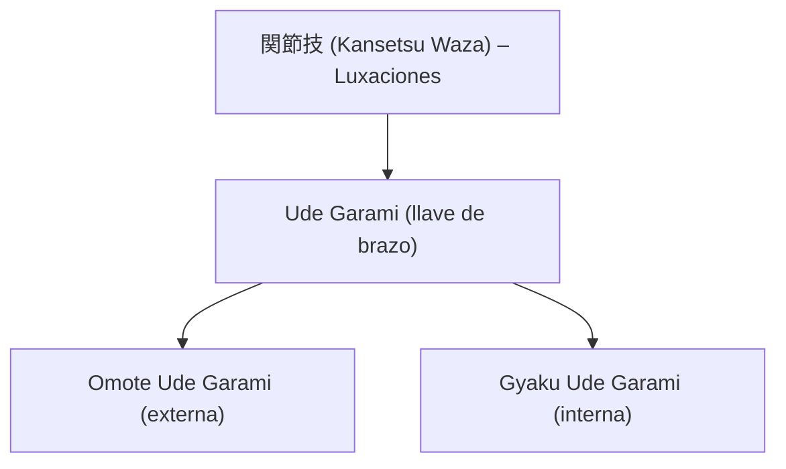

# 腕緘 (_Ude Garami_) – Llave de brazo en figura cuatro

![[Pasted image 20251003235812.png]]
![[Pasted image 20251003235818.png]]

## 🧾 1. Nombre en japonés

- **Kanji:** 腕緘
    
- **Romaji:** Ude Garami
    
- **Traducción literal:** “Entrelazamiento / luxación del brazo”
    

---

## 📖 2. Descripción general

**Ude Garami** es una técnica de luxación articular aplicada sobre el codo y el hombro, ampliamente utilizada en el **Jiu-Jitsu tradicional**, el **Judo** y el **BJJ**.

- Se ejecuta atrapando el brazo del oponente y bloqueándolo con los dos brazos del ejecutante, formando una **figura en cuatro (4)**.
    
- Permite controlar, inmovilizar o someter a un adversario mediante el principio de **palanca y torsión**.
    
- Su relevancia radica en que combina **control del oponente** con una amenaza directa de dolor o lesión, lo que obliga a la sumisión.
    

> [!info] Nota  
> Existen dos grandes variantes: **Ude Garami interna (Gyaku)** y **Ude Garami externa (Omote)**.

---

## ⚙️ 3. Principio técnico

- **Control de la articulación:** se busca bloquear el codo y generar torsión en el hombro.
    
- **Palanca de “figura cuatro”:** el propio brazo del ejecutante se entrelaza en forma de palanca.
    
- **Presión progresiva:** la llave se aplica lentamente para forzar la sumisión sin causar daño inmediato.
    
- **Uso del tronco y la cadera:** la fuerza no proviene de los brazos, sino del movimiento del cuerpo y el peso.
    

> [!tip] Clave técnica  
> Mantener el **ángulo del codo a 90°** es fundamental para que la presión se transmita al hombro.

---

## 🗂️ 4. Tipos de técnicas relacionadas

El **Ude Garami** pertenece a la familia de **Kansetsu Waza (関節技 – técnicas de luxación articular)**.

Variantes principales:

- **Omote Ude Garami (表腕緘):** llave externa, el brazo del oponente se gira hacia afuera.
    
- **Gyaku Ude Garami (逆腕緘):** llave interna, el brazo del oponente se gira hacia adentro.
    

---

## 🎯 5. Objetivos principales

- Controlar al adversario con mínima fuerza.
    
- Forzar sumisión a través del dolor controlado.
    
- Inmovilizar para **transición a estrangulamientos o controles en el suelo**.
    
- Enseñar al practicante precisión, timing y respeto por la seguridad del compañero.
    

---

## 🧘 6. Dimensión espiritual

El **Ude Garami** refleja valores clave del _Budō_:

- **Respeto y autocontrol:** es una técnica peligrosa si se aplica con brusquedad.
    
- **Responsabilidad:** el ejecutante tiene poder sobre la integridad del compañero.
    
- **Disciplina:** enseña a usar la técnica como herramienta de control, no de destrucción.
    

> [!quote] Filosofía  
> “El verdadero poder no está en causar daño, sino en controlar la capacidad de hacerlo.”

---

## 🥋 7. Disciplinas donde se practica

- **Jiu-Jitsu tradicional japonés**
    
- **Judo** (parte de las [[katame waza]] y del programa de competencia)
    
- **Brazilian Jiu-Jitsu (BJJ)** – conocido como _Americana_ (Omote) y _Kimura_ (Gyaku).
    
- **Artes marciales mixtas (MMA)** – como técnica de sumisión frecuente en combate.
    

---

## 🔗 8. Técnicas relacionadas

|Técnica|Kanji|Traducción|Relación|
|---|---|---|---|
|[[kansetsu waza]]|関節技|Técnicas de luxación|Familia general de Ude Garami|
|[[hiza gatame]]|膝固め|Control con rodilla|Otra luxación de brazo|
|[[ude hishigi juji gatame]]|腕挫十字固|Palanca de brazo en cruz|Variante clásica en suelo|
|[[omote ude garami]]|表腕緘|Llave de brazo externa|Versión hacia afuera|
|[[gyaku ude garami]]|逆腕緘|Llave de brazo interna|Versión hacia adentro|
|[[katame waza]]|固め技|Técnicas de control|Contexto donde se aplica Ude Garami|
