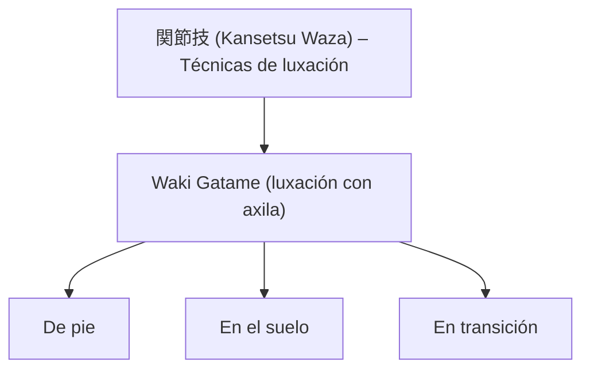

#  脇固め (_Waki Gatame_) – Luxación de brazo con la axila

![[Pasted image 20251004000200.png]]

## 🧾 1. Nombre en japonés

- **Kanji:** 脇固め
    
- **Romaji:** Waki Gatame
    
- **Traducción literal:** “Control/inmovilización con la axila”
    

---

## 📖 2. Descripción general

El **Waki Gatame** es una técnica de **luxación articular** aplicada al codo mediante el uso de la **axila como punto de apoyo**.

- El brazo del oponente se inmoviliza contra el tronco, introduciéndolo bajo la axila del ejecutante.
    
- Con el control de cadera y tronco, se ejerce presión sobre el codo hasta forzar la sumisión.
    
- Es relevante porque combina **simplicidad mecánica** con **gran efectividad**, utilizada tanto en combate cuerpo a cuerpo como en detenciones policiales.
    

> [!info] Nota  
> Debido a su peligrosidad (alto riesgo de lesión en el codo), el **Waki Gatame** suele practicarse con control en entrenamiento.

---

## ⚙️ 3. Principio técnico

- **Palanca natural:** la axila actúa como fulcro contra la articulación del codo.
    
- **Control del brazo extendido:** el brazo debe estar totalmente controlado y pegado al cuerpo.
    
- **Presión descendente:** el ejecutante usa el peso de su cuerpo, no solo la fuerza del brazo.
    
- **Seguridad:** aplicar de manera progresiva para evitar daños graves.
    

> [!tip] Clave técnica  
> El brazo inmovilizado debe estar **extendido y alineado**; si está doblado, la palanca pierde efectividad.

---

## 🗂️ 4. Tipos de técnicas relacionadas

El **Waki Gatame** pertenece a la familia de **Kansetsu Waza (関節技 – técnicas de luxación articular)** dentro de [[katame waza]].

Variantes frecuentes:

- **De pie (tachi waza):** usada para controlar a un oponente en movimiento.
    
- **En el suelo (ne waza):** combinada con inmovilizaciones.
    
- **Aplicación en transición:** desde agarres, proyecciones o defensa contra cuchillo/arma.
    

---

## 🎯 5. Objetivos principales

- Neutralizar al adversario mediante **luxación rápida y contundente**.
    
- Controlar con mínima energía, usando el peso corporal.
    
- Aplicar en contextos de autodefensa o control policial.
    
- Generar transición hacia inmovilización o sumisión definitiva.
    

---

## 🧘 6. Dimensión espiritual

El **Waki Gatame** refleja el concepto de **eficiencia y responsabilidad**:

- Enseña al practicante a usar su **cuerpo como herramienta de control**.
    
- Impone respeto, ya que el ejecutante controla completamente la integridad del rival.
    
- Resalta la necesidad de **autocontrol**: la técnica puede incapacitar de inmediato, por lo que requiere madurez en su aplicación.
    

> [!quote] Filosofía  
> “El verdadero poder no es romper, sino controlar lo que podría romperse.”

---

## 🥋 7. Disciplinas donde se practica

- **Jiu-Jitsu tradicional japonés**
    
- **Judo** – dentro de las [[kansetsu waza]]
    
- **Brazilian Jiu-Jitsu (BJJ)** – usado en transiciones y sumisiones específicas
    
- **Aikidō** – variantes similares en técnicas de control articular
    
- **Defensa personal / sistemas policiales** – como técnica de arresto
    

---

## 🔗 8. Técnicas relacionadas

|Técnica|Kanji|Traducción|Relación|
|---|---|---|---|
|[[kansetsu waza]]|関節技|Técnicas de luxación|Familia general|
|[[ude garami]]|腕緘|Llave de brazo en figura 4|Otra luxación de codo/hombro|
|[[hiza gatame]]|膝固め|Control con rodilla|Variante de presión articular|
|[[juji gatame]]|十字固め|Palanca de brazo en cruz|Luxación clásica en suelo|
|[[katame waza]]|固め技|Técnicas de control|Contexto donde se aplica|
