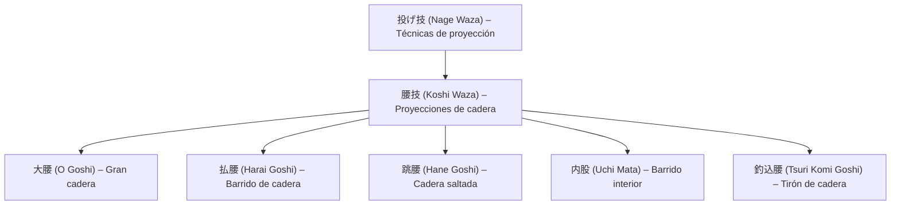

# 🌊 払腰 (_Harai Goshi_) – Barrido de cadera

![[Pasted image 20251004003854.png]]

## 🧾 1. Nombre en japonés

- **Kanji:** 払腰
    
- **Romaji:** Harai Goshi
    
- **Traducción literal:** “Barrido de cadera”
    

---

## 📖 2. Descripción general

El **Harai Goshi** es una técnica de **[[nage waza]] (投げ技 – técnicas de proyección)** perteneciente a la subfamilia de [[koshi waza]] (腰技 – técnicas de cadera).

- El ejecutante carga al adversario sobre su cadera y, con un **barrido de pierna**, lo proyecta hacia atrás en un movimiento circular.
    
- A diferencia del [[o goshi]] (gran cadera), el Harai Goshi añade el **barrido de la pierna contraria**, lo que potencia el desequilibrio del oponente.
    
- Es una de las técnicas más efectivas y utilizadas en **Judo competitivo**, además de mantenerse en el **Jiu-Jitsu tradicional** y en la **defensa personal**.
    

> [!info] Nota  
> El Harai Goshi es parte del programa clásico de Judo (_Nage no Kata_) y se enseña como técnica fundamental en múltiples escuelas de Jiu-Jitsu.

---

## ⚙️ 3. Principio técnico

- **Kuzushi (崩し – desequilibrio):** romper el equilibrio del adversario hacia adelante y en diagonal.
    
- **Tsukuri (作り – preparación):** girar y colocar la cadera debajo del centro de gravedad rival.
    
- **Kake (掛け – ejecución):** usar la pierna en barrido ascendente mientras se rota con la cadera.
    
- **Movimiento circular:** el adversario describe un arco completo antes de caer.
    

> [!tip] Clave técnica  
> El **barrido debe realizarse con el muslo o parte alta de la pierna**, no con el pie. Eso genera mayor control y potencia.

---

## 🗂️ 4. Tipos de técnicas relacionadas

El Harai Goshi pertenece a las **Koshi Waza (腰技 – técnicas de cadera)** dentro de [[nage waza]].

Variantes y técnicas similares:

- **O Goshi (大腰):** proyección de gran cadera.
    
- **Uchi Mata (内股):** barrido por dentro del muslo.
    
- **Hane Goshi (跳腰):** proyección con impulso de cadera.
    
- **Tsuri Komi Goshi (釣込腰):** cadera con tirón hacia arriba.
    

---

## 🎯 5. Objetivos principales

- Proyectar al adversario con **máximo control y potencia**.
    
- Usar la cadera como **punto de palanca principal**.
    
- Aprovechar el **barrido de pierna** para aumentar el desequilibrio.
    
- Aplicar tanto en contextos de **competencia** como de **defensa personal**.
    

---

## 🧘 6. Dimensión espiritual

El **Harai Goshi** representa el principio de la **armonía entre fluidez y firmeza**:

- La cadera firme y estable actúa como eje.
    
- La pierna fluida en barrido simboliza la **ola que arrastra al oponente**.
    
- Filosóficamente enseña a **combinar fuerza estable y movimiento flexible** en un solo gesto.
    

> [!quote] Filosofía  
> “Sé la ola que arrastra, no el muro que se resiste.”

---

## 🥋 7. Disciplinas donde se practica

- **Jiu-Jitsu tradicional japonés**
    
- **Judo** – técnica fundamental del programa de [[nage waza]].
    
- **Brazilian Jiu-Jitsu (BJJ)** – como proyección adaptada en pie.
    
- **MMA y Grappling** – en variantes adaptadas desde el clinch.
    

---

## 🔗 8. Técnicas relacionadas

|Técnica|Kanji|Traducción|Relación|
|---|---|---|---|
|[[nage waza]]|投げ技|Técnicas de proyección|Familia principal|
|[[koshi waza]]|腰技|Técnicas de cadera|Subfamilia directa|
|[[o goshi]]|大腰|Gran cadera|Similar, sin barrido de pierna|
|[[uchi mata]]|内股|Barrido interior de muslo|Variante interna|
|[[hane goshi]]|跳腰|Cadera saltada|Usa impulso de cadera|
