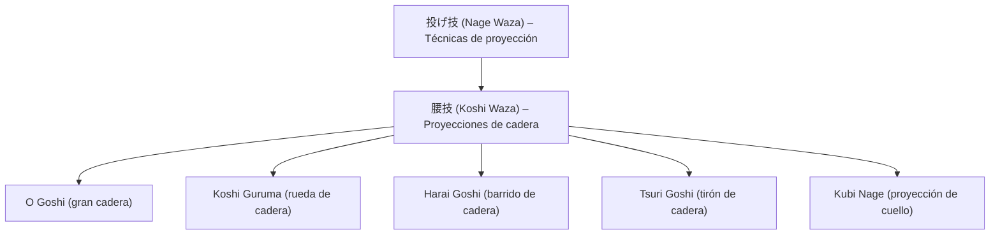

# 🌀 腰車 (_Koshi Guruma_) – Rueda de cadera

![[Pasted image 20251004003512.png]]

## 🧾 1. Nombre en japonés

- **Kanji:** 腰車
    
- **Romaji:** Koshi Guruma
    
- **Traducción literal:** “Rueda de cadera”
    

---

## 📖 2. Descripción general

El **Koshi Guruma** es una técnica de **[[nage waza]] (投げ技 – técnicas de proyección)** que se ejecuta usando la **cadera como punto de apoyo**.

- El ejecutante envuelve el cuello o la cabeza del oponente con el brazo, gira el cuerpo y proyecta al adversario por encima de su cadera.
    
- Es una de las proyecciones más características del Judo y Jiu-Jitsu tradicional, similar al **O Goshi (gran cadera)**, pero con el **agarre alrededor del cuello en lugar de la cintura**.
    
- Su relevancia radica en que enseña el uso correcto del **centro de gravedad y el control del eje corporal**.
    

> [!info] Nota  
> El **Koshi Guruma** forma parte del **Nage no Kata** en Judo, siendo una de las proyecciones clásicas de la familia de las técnicas de cadera (_Koshi Waza_).

---

## ⚙️ 3. Principio técnico

- **Control de la parte superior:** envolver el cuello/cabeza con el brazo.
    
- **Uso de la cadera como palanca:** el eje de la proyección nace del movimiento de cadera.
    
- **Carga del adversario sobre la cadera:** se transfiere el peso del oponente al propio centro.
    
- **Rotación en semicírculo:** el cuerpo gira como una rueda para llevar al oponente al suelo.
    

> [!tip] Clave técnica  
> La cadera debe estar **debajo del centro de gravedad del adversario** para que la proyección sea efectiva.

---

## 🗂️ 4. Tipos de técnicas relacionadas

El **Koshi Guruma** se encuentra en la subfamilia de **Koshi Waza (腰技 – técnicas de cadera)** dentro de [[nage waza]].

Comparación con técnicas afines:

- **O Goshi (大腰):** gran cadera, agarre en la cintura.
    
- **Kubi Nage (首投げ):** proyección de cuello, variante más directa.
    
- **Harai Goshi (払腰):** cadera barrida.
    
- **Tsuri Goshi (釣り腰):** cadera con tirón del cinturón.
    

---

## 🎯 5. Objetivos principales

- Derribar al adversario mediante el **uso de la cadera como palanca**.
    
- Enseñar coordinación de brazos, tronco y cadera.
    
- Controlar el equilibrio y centro de gravedad del oponente.
    
- Aplicar un movimiento fluido que combine defensa y ataque.
    

---

## 🧘 6. Dimensión espiritual

El **Koshi Guruma** transmite el principio del **equilibrio y la armonía en el movimiento**:

- Enseña a usar el propio centro de gravedad como eje de control.
    
- Representa la idea de que el **cuerpo entero trabaja como una rueda**, girando de forma natural y fluida.
    
- Filosóficamente, refleja la noción de que la **fuerza no se opone, se redirige** con un círculo completo.
    

> [!quote] Filosofía  
> “La rueda que gira con fluidez no se detiene; así fluye el guerrero con su adversario.”

---

## 🥋 7. Disciplinas donde se practica

- **Jiu-Jitsu tradicional japonés**
    
- **Judo** – técnica fundamental del [[nage waza]], incluida en el _Nage no Kata_.
    
- **Brazilian Jiu-Jitsu (BJJ)** – como variante de proyección en pie.
    
- **Artes marciales mixtas (MMA)** – adaptada para derribos explosivos desde clinch.
    

---

## 🔗 8. Técnicas relacionadas

|Técnica|Kanji|Traducción|Relación|
|---|---|---|---|
|[[nage waza]]|投げ技|Técnicas de proyección|Familia principal|
|[[koshi waza]]|腰技|Proyecciones de cadera|Subfamilia directa|
|[[o goshi]]|大腰|Gran cadera|Similar pero con agarre a la cintura|
|[[harai goshi]]|払腰|Barrido de cadera|Variante con barrido|
|[[tsuri goshi]]|釣り腰|Tirón de cadera|Variante con agarre al cinturón|
|[[kubi nage]]|首投げ|Proyección de cuello|Similar pero más directa|
