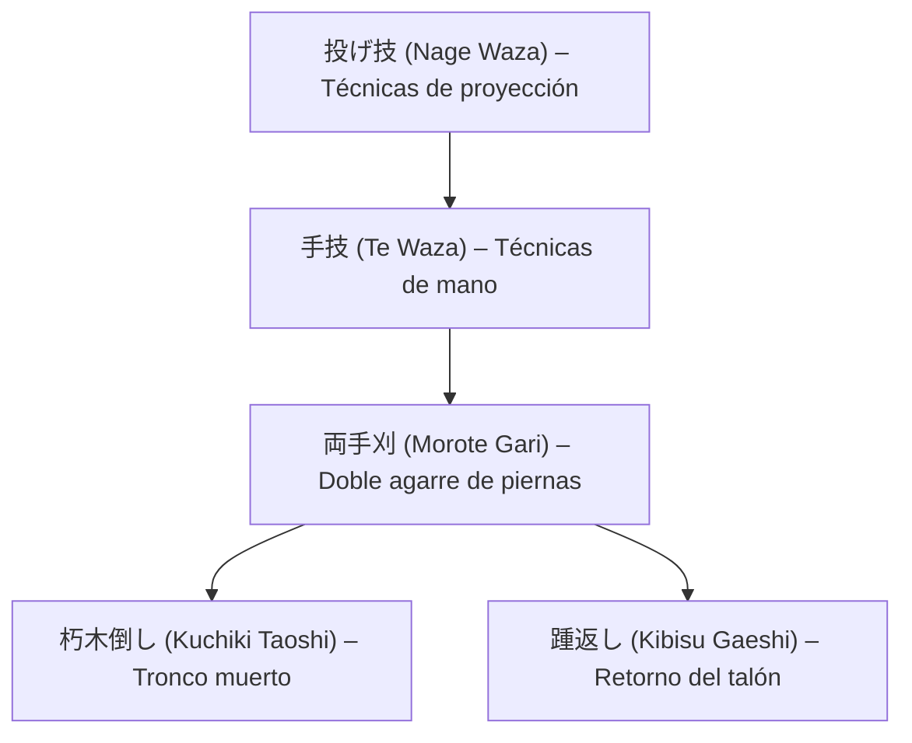

# 🤼‍♂️ 両手刈 (_Morote Gari_) – Cosecha con ambas manos

![[Pasted image 20251004003719.png]]

## 🧾 1. Nombre en japonés

- **Kanji:** 両手刈
    
- **Romaji:** Morote Gari
    
- **Traducción literal:** “Segar con ambas manos” o “cosecha a dos manos”
    

---

## 📖 2. Descripción general

El **Morote Gari** es una técnica de **[[nage waza]] (投げ技 – técnicas de proyección)**, clasificada dentro de [[te waza]] (手技 – técnicas de mano/brazo).

- El ejecutante **avanza hacia el adversario**, se agacha y sujeta ambas piernas con los brazos.
    
- Con un empuje hacia adelante y elevando las piernas del oponente, lo proyecta de espaldas al suelo.
    
- Es análogo al _double leg takedown_ de la lucha libre, pero con la filosofía y biomecánica del Judo/Jiu-Jitsu.
    

> [!info] Nota  
> Aunque fue una técnica oficial de Judo, la **IJF la restringió en competiciones deportivas modernas** (por ataques directos a las piernas). Sin embargo, se mantiene en el Jiu-Jitsu tradicional, defensa personal, MMA y lucha.

---

## ⚙️ 3. Principio técnico

- **Entrada explosiva:** el practicante cierra la distancia rápidamente.
    
- **Agarre a ambas piernas:** se sujeta detrás de las rodillas o en los muslos.
    
- **Elevación y empuje:** las piernas se levantan mientras se avanza con el cuerpo.
    
- **Control del centro de gravedad:** bajar la postura para estar debajo del rival y desestabilizarlo.
    

> [!tip] Clave técnica  
> El pecho debe permanecer **pegado al torso o cadera del oponente**, evitando dejar espacio para contraataques.

---

## 🗂️ 4. Tipos de técnicas relacionadas

El **Morote Gari** pertenece a la categoría de **[[te waza]] (手技 – técnicas de mano)** dentro de [[nage waza]].

Variantes y similares:

- **Kuchiki Taoshi (朽木倒し):** derribo de tronco muerto, una sola pierna.
    
- **Kibisu Gaeshi (踵返し):** contraataque tomando el talón.
    
- **Double Leg Takedown (MMA):** equivalente moderno adaptado.
    

---

## 🎯 5. Objetivos principales

- Derribar rápidamente al adversario con un movimiento explosivo.
    
- Controlar el centro de gravedad del oponente.
    
- Transición inmediata hacia [[katame waza]] (control en el suelo).
    
- Neutralizar ataques en pie, llevando la lucha al suelo.
    

---

## 🧘 6. Dimensión espiritual

El **Morote Gari** representa el principio de **determinación y decisión**:

- Enseña a **avanzar con compromiso total**, sin dudas.
    
- Simboliza la **cosecha del equilibrio del adversario**: arrebatarle su base de sustentación.
    
- Filosóficamente, enseña que para lograr el objetivo hay que **entrar en el terreno del otro sin temor**.
    

> [!quote] Filosofía  
> “Quien controla la base, controla todo el combate.”

---

## 🥋 7. Disciplinas donde se practica

- **Jiu-Jitsu tradicional japonés**
    
- **Judo** (aunque restringido en torneos IJF modernos)
    
- **Brazilian Jiu-Jitsu (BJJ)** – como derribo de inicio de combate.
    
- **Lucha libre olímpica / Grecorromana** – técnicas análogas.
    
- **Artes marciales mixtas (MMA)** – usado como takedown principal.
    
- **Defensa personal** – útil para neutralizar rápidamente.
    

---

## 🔗 8. Técnicas relacionadas

|Técnica|Kanji|Traducción|Relación|
|---|---|---|---|
|[[nage waza]]|投げ技|Técnicas de proyección|Familia principal|
|[[te waza]]|手技|Técnicas de mano|Subfamilia directa|
|[[kuchiki taoshi]]|朽木倒し|Tronco muerto|Variante con una pierna|
|[[kibisu gaeshi]]|踵返し|Retorno del talón|Contraataque con agarre del talón|
|[[kata guruma]]|肩車|Rueda sobre hombros|Técnica de mano afín|
|[[seoi nage]]|背負投げ|Proyección por la espalda|Otra proyección de brazo, distinta mecánica|

