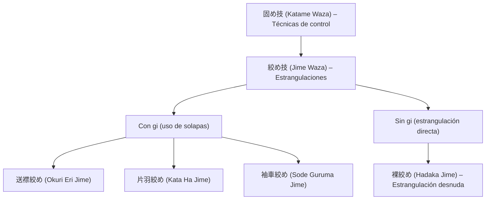

# 裸絞め (_Hadaka Jime_) – Estrangulación desnuda

![[Pasted image 20251004005320.png]]

## 🧾 1. Nombre en japonés

- **Kanji:** 裸絞め
    
- **Romaji:** Hadaka Jime
    
- **Traducción literal:** “Estrangulación desnuda” o “estrangulación sin agarre del gi”
    

---

## 📖 2. Descripción general

El **Hadaka Jime** es una de las técnicas clásicas de **[[jime waza]] (絞め技 – técnicas de estrangulación)** dentro de la familia de [[katame waza]] (固め技 – técnicas de control).

- Se denomina “desnuda” porque **no utiliza la ropa (gi) del oponente** para aplicar la estrangulación, a diferencia de otras técnicas como [[okuri eri jime]] o [[kata ha jime]].
    
- El estrangulamiento se realiza con los **brazos directamente alrededor del cuello** del adversario, utilizando presión con el antebrazo o el bíceps y el antebrazo opuesto.
    
- Es una técnica eficaz y directa, utilizada tanto en el **Jiu-Jitsu tradicional**, como en el **Judo**, el **Brazilian Jiu-Jitsu (BJJ)** y las **MMA**.
    

> [!info] Nota  
> El **Hadaka Jime** se conoce popularmente como _rear naked choke_ en inglés o _mata leão_ en portugués.

---

## ⚙️ 3. Principio técnico

- **Posicionamiento posterior:** el ejecutante se sitúa detrás del adversario.
    
- **Brazo de control:** un brazo rodea el cuello del oponente (antebrazo sobre la tráquea o arterias carótidas).
    
- **Cierre del estrangulamiento:** el brazo contrario bloquea el primero, formando un triángulo cerrado.
    
- **Presión controlada:** se ejerce una presión progresiva y simétrica hasta lograr la rendición o pérdida de consciencia.
    

> [!tip] Clave técnica  
> El **contacto entre bíceps y antebrazo** debe formar una “V” ajustada bajo el mentón; el brazo libre refuerza el cierre presionando detrás de la cabeza.

---

## 🗂️ 4. Tipos de técnicas relacionadas

El **Hadaka Jime** pertenece a la familia de **Jime Waza (絞め技 – técnicas de estrangulación)** dentro de [[katame waza]].

Clasificación general:

- **Con uso del gi:**
    
    - [[okuri eri jime]] (estrangulación con solapas cruzadas)
        
    - [[kata ha jime]] (estrangulación con solapa y brazo)
        
    - [[sode guruma jime]] (estrangulación con las mangas – “Ezekiel choke”)
        
- **Sin uso del gi:**
    
    - **Hadaka Jime** (estrangulación desnuda)
        
    - [[kata juji jime]] (cruce con antebrazos)
        
    - [[nami juji jime]] (cruce simétrico de brazos)
        

---

## 🎯 5. Objetivos principales

- Neutralizar y someter al oponente de manera inmediata.
    
- Controlar sin necesidad de usar la ropa del adversario.
    
- Aplicar una estrangulación segura y progresiva.
    
- Desarrollar control corporal, precisión y sensibilidad al aplicar presión.
    

---

## 🧘 6. Dimensión espiritual

El **Hadaka Jime** simboliza la **pureza del control directo**, sin intermediarios:

- Enseña el dominio total del cuerpo y la respiración.
    
- Representa la **eficacia desnuda** del Jiu-Jitsu: simple, directa y sin ornamentos.
    
- Filosóficamente, enseña la importancia de la **medida**: una presión justa, sin exceder el límite, expresa control y respeto.
    

> [!quote] Filosofía  
> “No es la fuerza lo que vence, sino la precisión con la que se aplica.”

---

## 🥋 7. Disciplinas donde se practica

- **Jiu-Jitsu tradicional japonés**
    
- **Judo** – técnica fundamental de [[jime waza]] en _Kime no Kata_ y _Katame no Kata_.
    
- **Brazilian Jiu-Jitsu (BJJ)** – conocida como _mata leão_.
    
- **MMA / Grappling** – como estrangulación básica desde la espalda.
    
- **Defensa personal moderna** – control no letal.
    

---

## 🔗 8. Técnicas relacionadas

|Técnica|Kanji|Traducción|Relación|
|---|---|---|---|
|[[katame waza]]|固め技|Técnicas de control|Familia principal|
|[[jime waza]]|絞め技|Técnicas de estrangulación|Subfamilia directa|
|[[okuri eri jime]]|送襟絞め|Estrangulación con solapas cruzadas|Variante con gi|
|[[kata ha jime]]|片羽絞め|Estrangulación con solapa y brazo|Variante mixta|
|[[sode guruma jime]]|袖車絞め|Estrangulación con mangas|Variante con control de brazo|
|[[kata juji jime]]|片十字絞め|Estrangulación cruzada parcial|Estrangulación directa similar|
