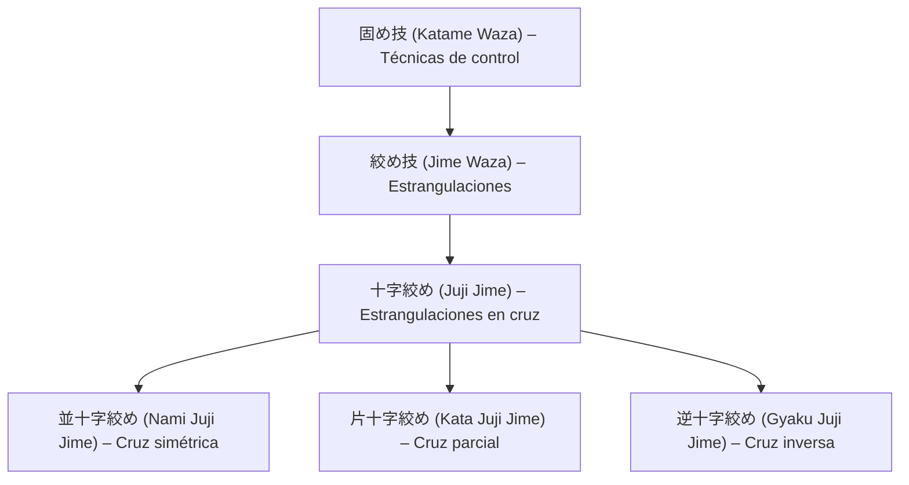

# ✖️ 片十字絞め (_Kata Jūji Jime_) – Estrangulación en cruz parcial

![[Pasted image 20251004005432.png]]

## 🧾 1. Nombre en japonés

- **Kanji:** 片十字絞め
    
- **Romaji:** Kata Jūji Jime
    
- **Traducción literal:** “Estrangulación de cruz parcial”
    

---

## 📖 2. Descripción general

El **Kata Jūji Jime** es una técnica de **[[jime waza]] (絞め技 – técnicas de estrangulación)** perteneciente a la familia de [[katame waza]] (固め技 – técnicas de control).

- Se ejecuta cruzando las **solapas del gi del oponente**, colocando una mano **en posición alta (palm up)** y la otra **en posición baja (palm down)**.
    
- Esta configuración parcial (“kata”, 片) permite ajustar la presión de forma progresiva y más controlada que el [[nami juji jime]] (cruz simétrica).
    
- Es una de las estrangulaciones más comunes y efectivas tanto en **Judo tradicional**, como en **Jiu-Jitsu clásico y BJJ**.
    

> [!info] Nota  
> “Jūji” (十字) significa “cruz”, haciendo referencia al cruce de los antebrazos que forman el símbolo “十”.

---

## ⚙️ 3. Principio técnico

- **Agarre asimétrico:** una mano con la palma hacia arriba toma la solapa profunda del cuello contrario, mientras la otra entra con la palma hacia abajo.
    
- **Cruce de antebrazos:** los antebrazos forman una “X” sobre las arterias carótidas.
    
- **Tensión progresiva:** el ejecutante estira los brazos y baja los codos mientras cierra el agarre.
    
- **Control del centro:** el cuerpo se mantiene alineado y estable, utilizando el peso para aumentar la presión.
    

> [!tip] Clave técnica  
> No tirar de los brazos hacia los lados: el cierre debe ser **compacto y descendente**, como si se “abrochara” el cuello del oponente.

---

## 🗂️ 4. Tipos de técnicas relacionadas

El **Kata Jūji Jime** pertenece a la familia de las **Juji Jime (十字絞め – estrangulaciones en cruz)** dentro de [[jime waza]].

Tipos principales:

- **[[nami juji jime]] (並十字絞め):** cruz simétrica, ambas palmas hacia arriba.
    
- **Kata juji jime (片十字絞め):** cruz parcial, una palma arriba y otra abajo.
    
- **Gyaku juji jime (逆十字絞め):** cruz inversa, ambas palmas hacia abajo.
    

---

## 🎯 5. Objetivos principales

- Estrangular al adversario mediante el cierre de las arterias carótidas.
    
- Utilizar la fuerza del **tronco y brazos en sinergia**, no solo los brazos.
    
- Controlar el oponente con técnica limpia, evitando esfuerzo innecesario.
    
- Mantener presión constante y seguridad durante la aplicación.
    

---

## 🧘 6. Dimensión espiritual

El **Kata Jūji Jime** simboliza el **equilibrio entre control y precisión**:

- Enseña que el verdadero poder proviene de la **simetría interior**, aunque el movimiento sea asimétrico.
    
- Representa la armonía entre la izquierda y la derecha, lo alto y lo bajo.
    
- Filosóficamente, invita a encontrar **estabilidad en el desequilibrio**, y control en la imperfección.
    

> [!quote] Filosofía  
> “No todo equilibrio es simétrico; el control nace del ajuste preciso.”

---

## 🥋 7. Disciplinas donde se practica

- **Judo** – técnica clásica de [[jime waza]], enseñada en el _Katame no Kata_.
    
- **Jiu-Jitsu tradicional japonés**
    
- **Brazilian Jiu-Jitsu (BJJ)** – base de estrangulaciones con solapas.
    
- **Defensa personal tradicional** – control eficaz en combate cerrado.
    

---

## 🔗 8. Técnicas relacionadas

| Técnica             | Kanji | Traducción                 | Relación              |
| ------------------- | ----- | -------------------------- | --------------------- |
| [[katame waza]]     | 固め技   | Técnicas de control        | Familia principal     |
| [[shime waza]]      | 絞め技   | Técnicas de estrangulación | Subfamilia directa    |
| [[juji jime]]       | 十字絞め  | Estrangulación en cruz     | Categoría general     |
| [[nami juji jime]]  | 並十字絞め | Cruz simétrica             | Variante estándar     |
| [[gyaku juji jime]] | 逆十字絞め | Cruz inversa               | Variante invertida    |
| [[hadaka jime]]     | 裸絞め   | Estrangulación desnuda     | Estrangulación sin gi |
