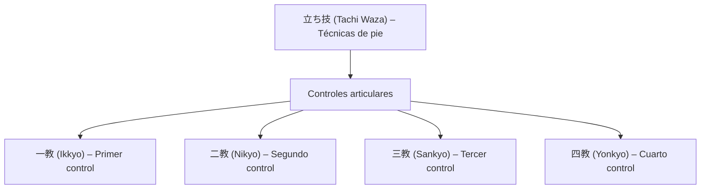

# 三教 (_Sankkyo_) – Tercera técnica de control

![[Pasted image 20251004004530.png]]![[Pasted image 20251004004542.png]]

## 🧾 1. Nombre en japonés

- **Kanji:** 三教
    
- **Romaji:** Sankkyo
    
- **Traducción literal:** “Tercera enseñanza / tercer principio”
    

---

## 📖 2. Descripción general

El **Sankyo** es una técnica de **control articular en pie**, usada en [[tachi waza]] (立ち技 – técnicas en posición vertical) y ampliamente practicada en **Jiu-Jitsu tradicional** y **Aikidō**.

- Consiste en sujetar la muñeca del oponente y torcerla con un movimiento en espiral, lo que transmite presión hacia el codo y el hombro.
    
- El dolor y la incomodidad permiten **controlar, inmovilizar o conducir** al adversario.
    
- Es especialmente relevante en contextos de **defensa personal y detención**, ya que permite someter sin necesidad de aplicar golpes.
    

> [!info] Nota  
> Sankyo es parte de una progresión pedagógica de controles: [[ikkyo]] (primer control), [[nikyo]] (segundo control), [[sankkyo]] (tercero), [[yonkyo]], etc.

---

## ⚙️ 3. Principio técnico

- **Control de la muñeca:** la torsión comienza en la articulación más pequeña.
    
- **Espiral ascendente:** el brazo del oponente se tuerce en forma helicoidal, llevando la energía hacia el hombro.
    
- **Dirección del cuerpo:** el ejecutante guía la torsión con un paso circular, manteniendo la conexión con el centro (hara).
    
- **Dolor controlado:** la llave genera sumisión sin necesidad de luxación completa.
    

> [!tip] Clave técnica  
> El Sankyo funciona mejor si se mantiene el **brazo extendido y proyectado hacia arriba**, incrementando la torsión sobre el hombro.

---

## 🗂️ 4. Tipos de técnicas relacionadas

El **Sankyo** forma parte de la **serie de controles clásicos** (ikkyo – yonkyo).

- **Ikkyo (一教):** control básico al codo.
    
- **Nikyo (二教):** torsión de muñeca interna.
    
- **Sankyo (三教):** torsión espiral ascendente.
    
- **Yonkyo (四教):** presión sobre el nervio radial.
    

---

## 🎯 5. Objetivos principales

- Someter y controlar al adversario mediante dolor articular.
    
- Guiar o conducir al oponente en detenciones.
    
- Neutralizar agresiones sin necesidad de golpear.
    
- Aplicar una **luxación progresiva y segura**.
    

---

## 🧘 6. Dimensión espiritual

El **Sankyo** enseña el principio de la **espiral y la continuidad**:

- Representa cómo la energía fluye en un movimiento circular sin interrupciones.
    
- Filosóficamente, muestra que el **control no siempre se logra con fuerza directa**, sino con movimientos que rodean y redirigen.
    
- En la vía del Budō, simboliza la **adaptación dinámica** frente a la resistencia.
    

> [!quote] Filosofía  
> “La espiral nunca se detiene: envuelve y transforma la energía del adversario.”

---

## 🥋 7. Disciplinas donde se practica

- **Jiu-Jitsu tradicional japonés**
    
- **Aikidō** – una de las técnicas de control básicas del programa pedagógico.
    
- **Judo (Kansetsu waza adaptados en pie)**
    
- **Defensa personal moderna y sistemas policiales**
    

---

## 🔗 8. Técnicas relacionadas

| Técnica        | Kanji | Traducción      | Relación                      |
| -------------- | ----- | --------------- | ----------------------------- |
| [[ikkyo]]      | 一教    | Primer control  | Base de los controles en pie  |
| [[nikkyo]]     | 二教    | Segundo control | Llave de muñeca interna       |
| [[sankkyo]]    | 三教    | Tercer control  | Espiral ascendente            |
| [[yonkkyo]]    | 四教    | Cuarto control  | Presión nerviosa en antebrazo |
| [[tachi waza]] | 立ち技   | Técnicas en pie | Contexto principal            |
