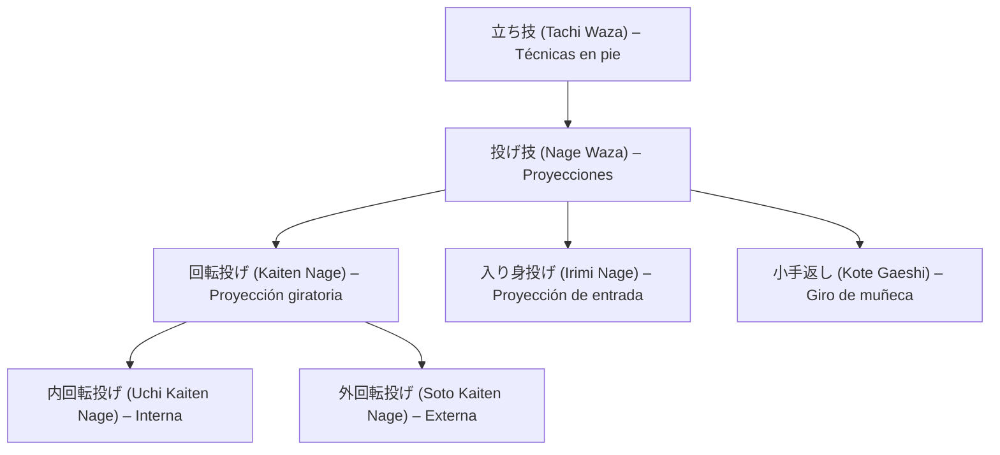

# 🔄 内回転投げ (_Uchi Kaiten Nage_) – Proyección giratoria interna

![[Pasted image 20251004004825.png]]

## 🧾 1. Nombre en japonés

- **Kanji:** 内回転投げ
    
- **Romaji:** Uchi Kaiten Nage
    
- **Traducción literal:** “Proyección de rotación interna”
    

---

## 📖 2. Descripción general

**Uchi Kaiten Nage** es una técnica de **[[tachi waza]] (立ち技 – técnicas en pie)** y una proyección clásica del **Jiu-Jitsu tradicional** y el **Aikidō**.

- Consiste en **redireccionar un ataque** (generalmente un golpe o agarre al cuello/brazo), entrando por el interior del movimiento del adversario.
    
- El ejecutante utiliza un **movimiento giratorio del cuerpo (kaiten)** para desequilibrar al oponente y proyectarlo con control, normalmente finalizando en una caída amplia o inmovilización.
    
- Es relevante porque integra tres conceptos fundamentales del Jiu-Jitsu: **entrada (irimi)**, **rotación (kaiten)** y **fluidez (nagare)**.
    

> [!info] Nota  
> “Uchi” (内) significa _interno_ y “Kaiten” (回転) _rotación_, describiendo la dirección y dinámica de la proyección.

---

## ⚙️ 3. Principio técnico

- **Entrada interna (irimi):** el ejecutante se desplaza hacia el centro del adversario, esquivando el ataque.
    
- **Movimiento circular (kaiten):** el cuerpo gira en un eje fluido, aprovechando la inercia del oponente.
    
- **Desequilibrio (kuzushi):** se rompe el equilibrio mientras se controla el brazo o cuello.
    
- **Proyección (nage):** el adversario es conducido hacia el suelo mediante un arco continuo y amplio.
    

> [!tip] Clave técnica  
> El eje de giro debe pasar **por el centro del oponente**, no por el propio centro, para maximizar el control de la caída.

---

## 🗂️ 4. Tipos de técnicas relacionadas

El **Uchi Kaiten Nage** pertenece a la familia de **Nage Waza (投げ技 – técnicas de proyección)** dentro de [[tachi waza]].

Clasificación general de proyecciones por dirección:

- **Uchi Kaiten Nage (内回転投げ):** rotación interna.
    
- **Soto Kaiten Nage (外回転投げ):** rotación externa.
    
- **Irimi Nage (入り身投げ):** proyección de entrada directa.
    
- **Kote Gaeshi (小手返し):** proyección por torsión de muñeca.
    

---

## 🎯 5. Objetivos principales

- Desviar y redirigir la fuerza del ataque hacia el vacío.
    
- Usar el movimiento circular para desequilibrar y proyectar.
    
- Mantener control continuo del adversario durante la caída.
    
- Transformar la defensa en un flujo ofensivo natural.
    

---

## 🧘 6. Dimensión espiritual

El **Uchi Kaiten Nage** representa el principio del **movimiento continuo y circular** del _Budō_:

- Enseña a **fluir dentro del ataque**, sin resistencia.
    
- El giro interno simboliza **introspección y adaptación**: el movimiento nace del centro (_hara_) y se expande hacia afuera.
    
- Filosóficamente, expresa la unión entre **suavidad y poder**, al transformar la energía agresiva del oponente en su propia derrota.
    

> [!quote] Filosofía  
> “Quien gira dentro del ataque, convierte la fuerza del enemigo en su camino.”

---

## 🥋 7. Disciplinas donde se practica

- **Jiu-Jitsu tradicional japonés**
    
- **Aikidō** – técnica central del programa intermedio.
    
- **Judo (Koshin Judo / Defensa personal tradicional)**
    
- **Defensa personal moderna** – usada en transiciones y controles de brazo.
    

---

## 🔗 8. Técnicas relacionadas

|Técnica|Kanji|Traducción|Relación|
|---|---|---|---|
|[[tachi waza]]|立ち技|Técnicas en pie|Contexto general|
|[[nage waza]]|投げ技|Técnicas de proyección|Familia directa|
|[[soto kaiten nage]]|外回転投げ|Proyección giratoria externa|Variante opuesta|
|[[irimi nage]]|入り身投げ|Proyección de entrada directa|Similar en dinámica de irimi|
|[[kote gaeshi]]|小手返し|Giro de muñeca|Complementaria en control y proyección|
|[[ikkyo]]|一教|Primer control|Transición desde control articular a proyección|
