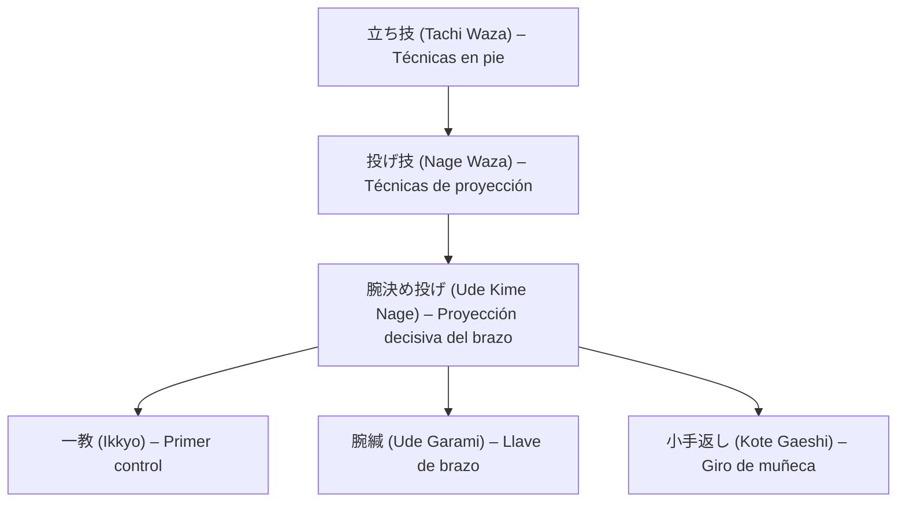

# 腕決め投げ (_Ude Kime Nage_) – Proyección decisiva del brazo

![[Pasted image 20251004004937.png]]

## 🧾 1. Nombre en japonés

- **Kanji:** 腕決め投げ
    
- **Romaji:** Ude Kime Nage
    
- **Traducción literal:** “Proyección decisiva del brazo”
    

---

## 📖 2. Descripción general

El **Ude Kime Nage** es una técnica de **[[tachi waza]] (立ち技 – técnicas en pie)** perteneciente a la categoría de **[[nage waza]] (投げ技 – técnicas de proyección)**, en la cual el ejecutante proyecta al oponente utilizando una **luxación o palanca sobre el brazo**.

- Se basa en controlar el brazo del atacante, **extenderlo completamente** y aplicar una presión descendente o torsión mientras se realiza la proyección.
    
- Es una técnica **decisiva y contundente**, ya que combina **desequilibrio (kuzushi)**, **luxación articular (kansetsu)** y **proyección (nage)** en un solo movimiento.
    
- En el contexto del Jiu-Jitsu tradicional, se usa tanto como **respuesta a un golpe o agarre**, como en transiciones desde [[ikkyo]] o [[nikyo]].
    

> [!info] Nota  
> En algunos estilos de Aikidō, esta técnica se denomina _Ude Kime Nage_ o _Kime Nage_, y representa el concepto de “decisión final” (_kime_) dentro del control del adversario.

---

## ⚙️ 3. Principio técnico

- **Control del brazo:** se captura el brazo atacante (generalmente un golpe o agarre).
    
- **Extensión y bloqueo:** el brazo se extiende completamente, bloqueando el codo.
    
- **Proyección del cuerpo:** el ejecutante usa su movimiento hacia adelante para llevar al adversario al suelo.
    
- **Kime (決め):** concentración total de energía y determinación en el momento de aplicar la técnica.
    

> [!tip] Clave técnica  
> La proyección debe nacer del **centro del cuerpo (hara)**, no solo del movimiento de brazos. El control corporal es lo que da verdadera “decisión” a la técnica.

---

## 🗂️ 4. Tipos de técnicas relacionadas

El **Ude Kime Nage** combina elementos de **[[kansetsu waza]] (関節技 – técnicas de luxación articular)** y **[[nage waza]]**, por lo que se considera una técnica **mixta o híbrida** de control y proyección.

Técnicas y variantes relacionadas:

- **Ikkyo (一教):** control básico del brazo.
    
- **Ude Garami (腕緘):** luxación de brazo en figura cuatro.
    
- **Juji Gatame (十字固め):** palanca de brazo cruzada.
    
- **Kote Gaeshi (小手返し):** proyección por torsión de muñeca.
    

---

## 🎯 5. Objetivos principales

- Neutralizar al oponente con **una acción decisiva y controlada**.
    
- Integrar **luxación y proyección** en un solo movimiento fluido.
    
- Mantener control del brazo durante toda la proyección.
    
- Evitar daños innecesarios mediante el principio de control progresivo.
    

---

## 🧘 6. Dimensión espiritual

El **Ude Kime Nage** encarna el principio de **Kime (決め)** — _determinación, decisión total_:

- Enseña a aplicar la técnica con **plena intención**, sin duda ni vacilación.
    
- Refleja el estado de **zanshin (残心)**, o atención continua, después de ejecutar la proyección.
    
- Filosóficamente, representa el equilibrio entre **resolución y compasión**: decidir con firmeza, pero sin odio.
    

> [!quote] Filosofía  
> “La decisión del cuerpo y la mente es una sola. Cuando la intención es pura, el movimiento es perfecto.”

---

## 🥋 7. Disciplinas donde se practica

- **Jiu-Jitsu tradicional japonés**
    
- **Aikidō** – técnica intermedia o avanzada del programa clásico.
    
- **Judo (Kansetsu Nage – proyecciones con luxación)**
    
- **Defensa personal moderna** – empleada para neutralizar ataques con golpes o armas.
    

---

## 🔗 8. Técnicas relacionadas

|Técnica|Kanji|Traducción|Relación|
|---|---|---|---|
|[[tachi waza]]|立ち技|Técnicas en pie|Contexto general|
|[[nage waza]]|投げ技|Técnicas de proyección|Familia principal|
|[[kansetsu waza]]|関節技|Técnicas de luxación|Base mecánica|
|[[ikkyo]]|一教|Primer control|Origen de la estructura del brazo|
|[[ude garami]]|腕緘|Llave de brazo|Técnica afín de luxación|
|[[kote gaeshi]]|小手返し|Giro de muñeca|Proyección similar por rotación|
|[[juji gatame]]|十字固め|Palanca cruzada de brazo|Luxación equivalente en suelo|
