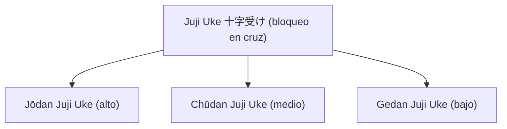

# ✖️ 十字受け (_Juji Uke_) – Bloqueo en cruz

![[Pasted image 20251003235021.png]]

## 🧾 1. Nombre en japonés

- **Kanji:** 十字受け
    
- **Romaji:** Juji Uke
    
- **Traducción literal:** “Bloqueo en cruz”
    

---

## 📖 2. Descripción general

**Juji Uke** es una técnica defensiva en la cual los brazos se colocan en **forma de cruz (十字)** para detener o desviar un ataque.

- El cruce puede ser **alto (jōdan)** para proteger el rostro, o **medio/bajo (chūdan/gedan)** para cubrir el torso y zona inferior.
    
- Es especialmente efectivo contra ataques descendentes, golpes de arma o técnicas contundentes que requieren un **bloqueo fuerte y estructurado**.
    
- En Jiu-Jitsu y Karate se utiliza tanto para defensa contra golpes directos como para absorber ataques con armas (bokken, bo, cuchillo).
    

> [!info] Diferencia clave  
> A diferencia de bloqueos individuales (_age uke_, _soto uke_), en **Juji Uke** se combinan ambos brazos en un único punto de intercepción, creando una “barrera sólida”.

---

## ⚙️ 3. Principio técnico

- **Cruz de protección:** los antebrazos se superponen formando una “X” que concentra fuerza y estabilidad.
    
- **Ángulo correcto:** la intercepción debe hacerse en diagonal, nunca totalmente recto, para distribuir el impacto.
    
- **Uso del centro del cuerpo (hara):** el bloqueo nace de la cadera y el core, no solo de los brazos.
    
- **Preparación al contraataque:** tras desviar o absorber, los brazos se abren para generar un espacio de respuesta inmediata.
    

> [!tip] Clave técnica  
> El brazo superior y el inferior deben estar **firmes pero flexibles**, para evitar lesiones en la articulación del codo.

---

## 🗂️ 4. Tipos de técnicas relacionadas

El Juji Uke se integra en la familia de los **Uke Waza (bloqueos/recepciones)**.  
Existen diferentes variaciones:

- **Jōdan Juji Uke (上段十字受け):** bloqueo en cruz alto (rostro/cabeza).
    
- **Chūdan Juji Uke (中段十字受け):** bloqueo en cruz medio (torso).
    
- **Gedan Juji Uke (下段十字受け):** bloqueo en cruz bajo (piernas/ingle).
    

---

## 🎯 5. Objetivos principales

- Interceptar ataques fuertes con un bloqueo estructurado.
    
- Proteger zonas vitales (cabeza, torso, ingle).
    
- Absorber ataques descendentes o con armas.
    
- Crear un espacio inmediato para contraatacar.
    

---

## 🧘 6. Dimensión espiritual

El **Juji Uke** representa el equilibrio de fuerzas en el cruce:

- Simboliza la **intersección de caminos**, donde la defensa y el ataque se encuentran.
    
- Enseña a **afrontar directamente la adversidad** sin ceder, pero con control.
    
- La forma de “X” recuerda la unión de **yin y yang**, fuerza y suavidad, estabilidad y movimiento.
    

> [!quote] Filosofía  
> “En el cruce de la fuerza y la calma, nace la verdadera defensa.”

---

## 🥋 7. Disciplinas donde se practica

- **Jiu-Jitsu tradicional japonés**
    
- **Karate-dō** (Shotokan, Shito-Ryū, Kyokushin, etc.)
    
- **Aikidō** (aplicación contra ataques descendentes con armas)
    
- **Kobudō** (defensa contra bo, bokken, tonfa)
    

---

## 🔗 8. Técnicas relacionadas

|Técnica|Kanji|Traducción|Relación|
|---|---|---|---|
|[[age uke]]|上げ受け|Bloqueo ascendente|Variante lineal de defensa alta|
|[[soto uke]]|外受け|Bloqueo hacia afuera|Defensa lateral individual|
|[[uchi uke]]|内受け|Bloqueo hacia adentro|Defensa hacia el centro|
|[[gedan barai]]|下段払い|Bloqueo bajo|Alternativa a Juji Uke en defensa baja|
|[[nagashi uke]]|流し受け|Bloqueo deslizante|Defensa suave frente a fuerza directa|
|[[juji uke]]|十字受け|Bloqueo en cruz|Intercepción sólida y estructurada|
